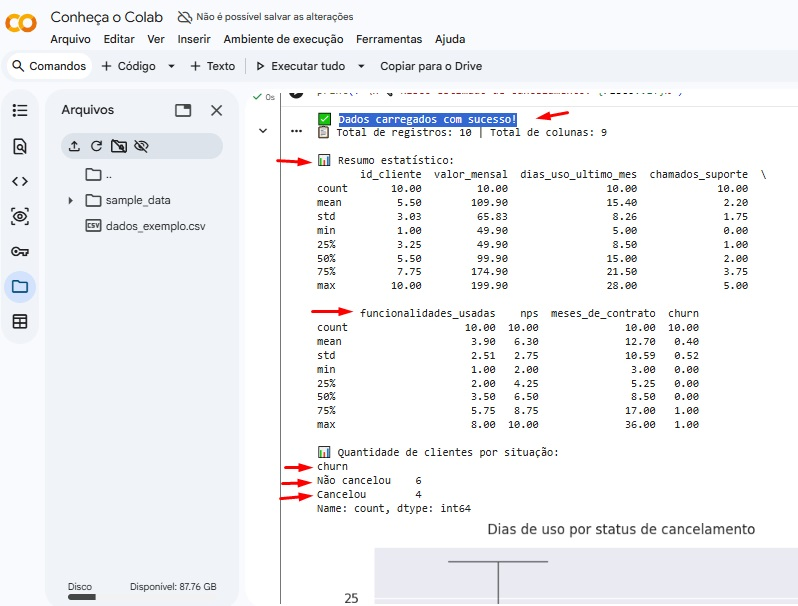
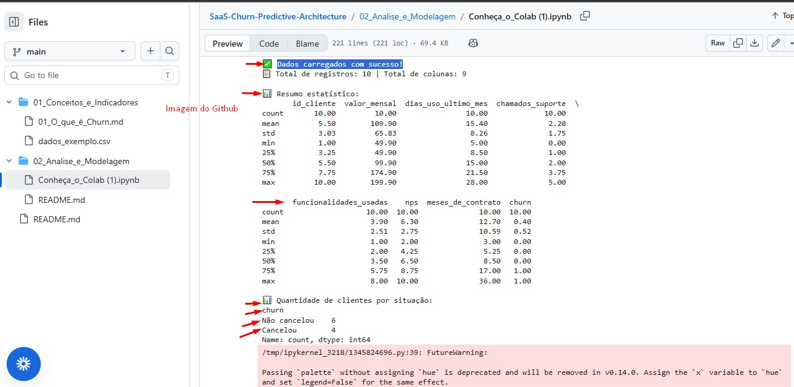
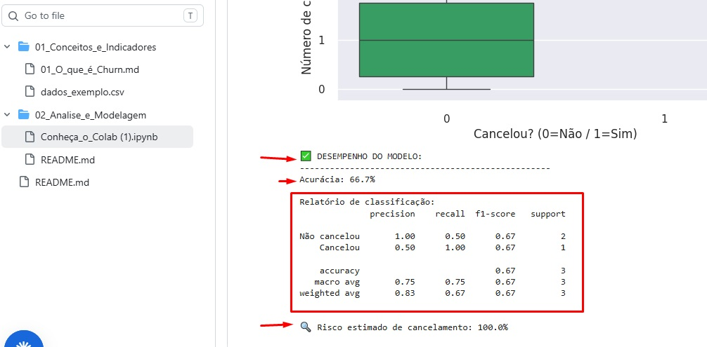

# 📊 SaaS Churn Predictive Architecture

**Arquitetura de Dados para Prevenção de Churn e Gestão de Contas em SaaS**

Projeto prático que une conceitos de Customer Success, análise de dados e aprendizado de máquina para identificar clientes com risco de cancelamento — permitindo ações preventivas e crescimento sustentável.

---

## 📸 Capturas do Projeto

### 📌 Execução e resultados no Google Colab

### 📊 Análise: Padrões de uso vs Cancelamento

### 🤖 Desempenho do modelo preditivo

---

## 📂 Estrutura do Projeto
